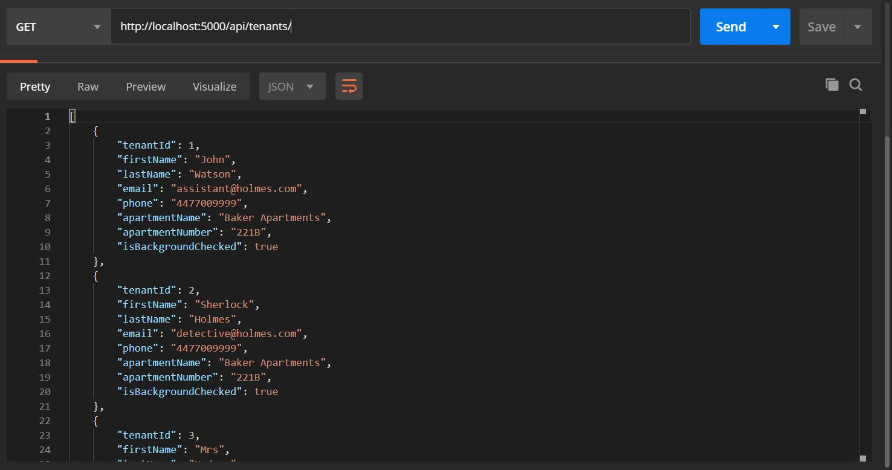
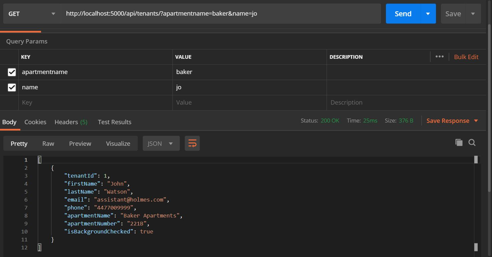
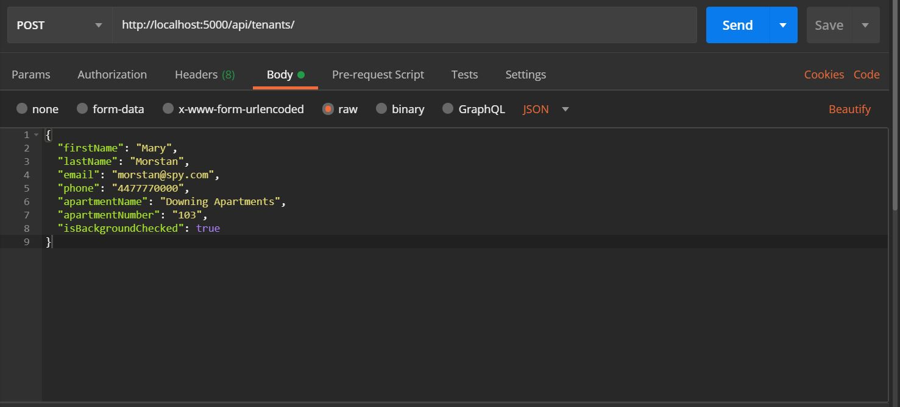
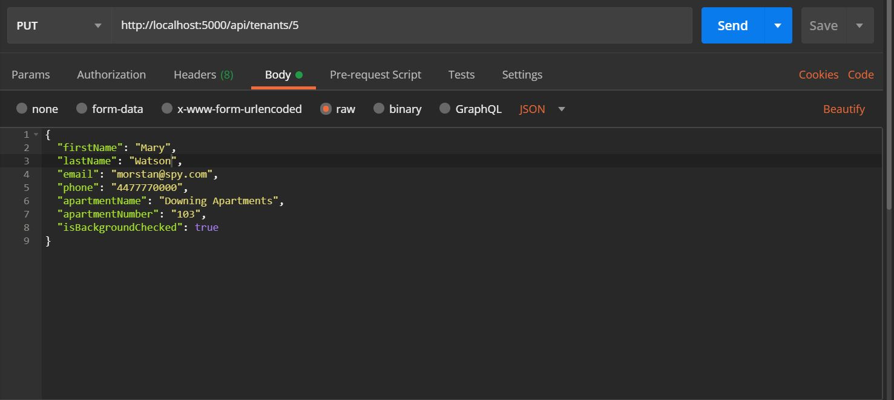
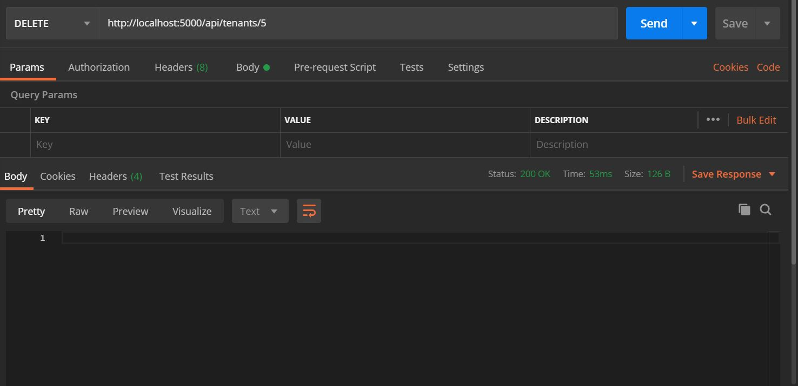

<div align=center>

# [Tenant API](https://github.com/ayohana/TenantAPI.git/)

#### C# API Building Exercise for [Epicodus](https://www.epicodus.com/), 04.03.2020 v. 2.0

#### By [**Adela Darmansyah**](https://ayohana.github.io/portfolio/)

[About](#About) | [User Stories](#User-Stories) | [Installation](#Installation-Instructions) | [Version History](#Version-History) | [Screenshots](#Screenshots) | [Bugs](#Known-Bugs) | [Technologies](#Technologies-Used) | [Contact](#Support-and-Contact-Details)

   

</div>

## About

**A service API that allows apartment managers to keep track of their tenants' contact information.**

## User Stories

* As a manager, I want to be able to view (`GET`) and add (`POST`) contact information of tenants.
* As a manager, I want to view (`GET`) a list of contact information by apartment name, apartment number or by a tenant's last name.
* As a manager, I want to be able to update (`PUT`) and remove (`DELETE`) tenants.
* As a developer, I want the application to still be able to display query search results when a user inputs only part of an apartment name. For instance, search query of apartment name `"baker"` will display tenants listed under `"Baker Apartments"`.
* As a developer, I want to add a feature of API versioning so that I can keep different versions when I upgrade the application.

## Installation Instructions

* Download [.NET Core](https://www.learnhowtoprogram.com/c-and-net/getting-started-with-c/installing-c-and-net) (Mac/Windows OS) - _FREE!_
* Download [MySQL](https://www.learnhowtoprogram.com/c-and-net/getting-started-with-c/installing-and-configuring-mysql) (Mac/Windows OS) - _FREE!_
* Download [Postman](https://www.postman.com/downloads/) (Mac/Windows OS) - _FREE!_
* Clone this [repository](https://github.com/ayohana/TenantAPI.git/)
* Run the application.
  * Navigate into the `TenantAPI` directory `$ cd Desktop/TenantAPI/`
    * Enter the command `dotnet restore` to gather tools and dependencies for the application.
    * Enter the command `dotnet build` to build the project using its dependencies.
    * Enter the command `dotnet ef database update` to create a new, empty database. 
    * Enter `dotnet run` to run the application.
    * Enter URL `http://localhost:5000/api/tenants` in Postman using one of the HTTP Methods [below](#HTTP-Methods-and-Routes).

## Version History

<details>
  <summary>2.0</summary>

  <br>

  | Features | Input | Output |
  | :----------- | :---- | :----- |
  | Improved query search `apartmentname` and `apartmentnumber`  for `GET` action. <br> When a user enters a partial/incomplete apartment name or number, the application will still return results based on the input. | `http://localhost:5000/api/tenants/?apartmentname=b&apartmentnumber=2` | List of tenants with apartment names consist of `"b"` and apartment numbers consist of `"2"`  |
  | Changed `lastname` query key to `name` for `GET` action. <br> A user can enter a name and the application will search through first and last names. | `http://localhost:5000/api/tenants/?name=ho` | List of tenants with first or last names consist of `"ho"`  |
  | Set default application to run on version 2.0. No need to specify in the query string. | `http://localhost:5000/api/tenants` | List of all tenants  |
  | Functionalities listed [below](#HTTP-Methods-and-Routes-v.-2.0). | N/A | N/A |

#### HTTP Methods and Routes v. 2.0

| HTTP Method | HTTP Route | Input | Output |
| :---------- | :--------- | :---- | :----- |
| GET | `http://localhost:5000/api/tenants` | N/A | View a list of all tenants |
| GET | `http://localhost:5000/api/tenants?apartmentname=`name+of+apt`&apartmentnumber=`apt#`&name=`name`` | Insert search query values to HTTP route  | View a list of tenants by apartment name, apartment number and/or name. |
| POST | `http://localhost:5000/api/tenants` | [Raw JSON body](#Sample-of-a-Raw-JSON-body) | Create a new tenant |
| PUT | `http://localhost:5000/api/tenants/{id}` | [Raw JSON body](#Sample-of-a-Raw-JSON-body) | Edit information on a tenant |
| DELETE | `http://localhost:5000/api/tenants/{id}` | N/A | Remove a tenant |

#### Sample of a Raw JSON body:

`````
{
  "firstName": "Mary",
  "lastName": "Morstan",
  "email": "morstan@spy.com",
  "phone": "4477770000",
  "apartmentName": "Downing Apartments",
  "apartmentNumber": "103",
  "isBackgroundChecked": true
}
`````

</details>

<details>
  <summary>1.0</summary>

  <br>

  | Features |
  | :----------- |
  | Basic working functionalities listed [below](#HTTP-Methods-and-Routes-v.-1.0). |
  | **To call version 1.0, specify the version in the query string,** i.e. `http://localhost:5000/api/tenants/?api-version=1.0` |

#### HTTP Methods and Routes v. 1.0

| HTTP Method | HTTP Route | Input | Output |
| :---------- | :--------- | :---- | :----- |
| GET | `http://localhost:5000/api/tenants/?api-version=1.0` | N/A | View a list of all tenants |
| GET | `http://localhost:5000/api/tenants/?api-version=1.0&apartmentname=`name+of+apt`&apartmentnumber=`apt#`&lastname=`last+name`` | Insert search query values to HTTP route  | View a list of tenants by apartment name, apartment number and/or last name. |
| POST | `http://localhost:5000/api/tenants/?api-version=1.0` | [Raw JSON body](#Sample-of-a-Raw-JSON-body) | Create a new tenant |
| PUT | `http://localhost:5000/api/tenants/{id}/?api-version=1.0` | [Raw JSON body](#Sample-of-a-Raw-JSON-body) | Edit information on a tenant |
| DELETE | `http://localhost:5000/api/tenants/{id}/?api-version=1.0` | N/A | Remove a tenant |

#### Sample of a Raw JSON body:

`````
{
  "firstName": "Mary",
  "lastName": "Morstan",
  "email": "morstan@spy.com",
  "phone": "4477770000",
  "apartmentName": "Downing Apartments",
  "apartmentNumber": "103",
  "isBackgroundChecked": true
}
`````

</details>

## Screenshots

View all tenants in Postman:



View tenants with search query parameters:



Add new tenant:



Update a tenant:



Remove a tenant:



## Known Bugs

No known bugs at this time.

## Technologies Used

* C#
* [.NET Core](https://dotnet.microsoft.com/download/dotnet-core/) (Windows OS)
* [MySQL](https://dev.mysql.com/downloads/file/?id=484919) (Windows OS)
* [EF Core](https://github.com/PomeloFoundation/Pomelo.EntityFrameworkCore.MySql)
* [Postman](https://www.postman.com/downloads/)
* [API Versioning](https://neelbhatt.com/2018/04/21/api-versioning-in-net-core/)
* [Azure](https://docs.microsoft.com/en-us/azure/app-service/app-service-web-tutorial-dotnetcore-sqldb)

## Support and Contact Details

Feel free to provide feedback via email: adela.yohana@gmail.com.

### License

This application is licensed under the MIT license.

Copyright (c) 2020 **Adela Darmansyah**